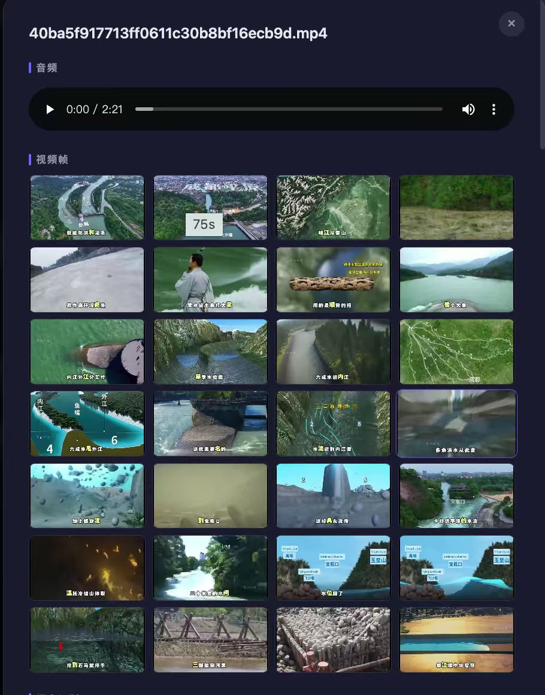
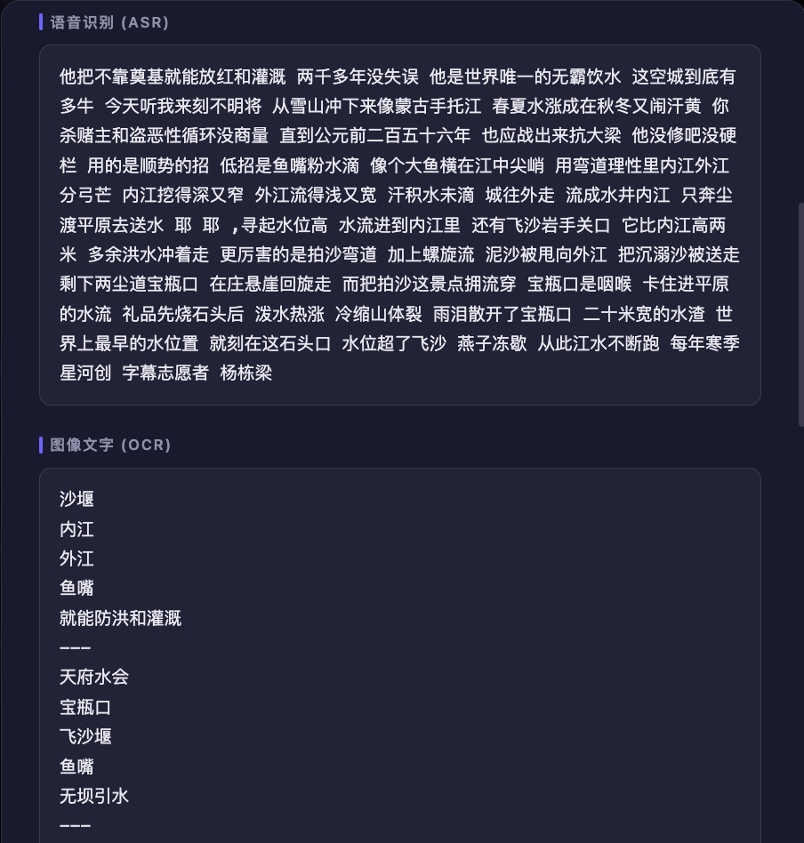
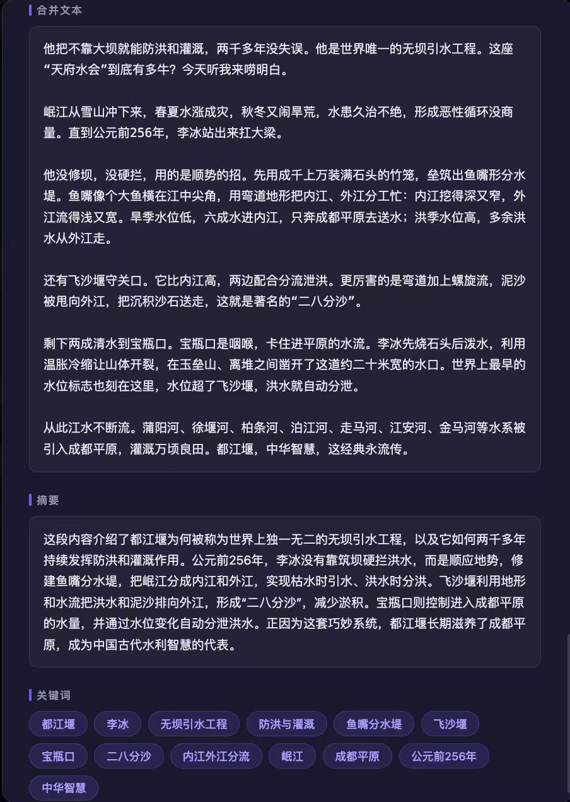

# Media AI Agent

> 智能媒体分析 Agent —— 上传视频/音频，自动完成语音识别、画面文字提取、内容摘要与关键词生成。

基于 **FastAPI + FFmpeg + 大模型 API** 构建的全流程 AI Agent，支持长视频/音频的自动化内容理解。

---

## 效果展示

### 上传界面
支持拖拽或点击上传，兼容 mp4 / mov / avi / mkv / mp3 / wav / m4a 等主流格式。



### 处理状态
上传后自动开始处理，实时显示任务状态，支持多任务并行。



### 分析结果
处理完成后可查看完整分析结果，包括音频播放、视频帧预览、语音识别文本、OCR 文字、合并文本、智能摘要和关键词。



---

## 功能特性

- **视频/音频上传** — 拖拽上传，自动检测媒体类型
- **音频提取** — FFmpeg 自动从视频中分离音轨
- **视频抽帧** — 每隔 N 秒自动截取关键帧
- **语音识别 (ASR)** — 支持 Whisper API / 本地 faster-whisper 模型
- **画面文字识别 (OCR)** — 基于 GPT-4o 视觉能力，逐帧提取画面中的文字
- **智能文本融合** — LLM 自动合并 ASR + OCR 文本，去重整理
- **内容摘要** — 大模型生成结构化摘要
- **关键词提取** — 自动提取核心关键词
- **任务管理** — 支持查看历史记录、删除任务及相关文件
- **暗色 UI** — 现代化深色主题界面

---

## 技术架构

```
用户上传文件
    │
    ├─ 视频 ─┬─ FFmpeg 提取音频 ──► ASR（语音识别）
    │        └─ FFmpeg 抽帧     ──► OCR（视觉识别）
    │
    └─ 音频 ────────────────────► ASR（语音识别）

                    ASR 文本 + OCR 文本
                          │
                    LLM 融合/去重 → merged_text
                          │
                    LLM 摘要     → summary
                          │
                    LLM 关键词   → keywords
```

### 技术栈

| 层级 | 技术 |
|------|------|
| 后端框架 | FastAPI + Uvicorn |
| 媒体处理 | FFmpeg |
| 语音识别 | Whisper API / faster-whisper |
| 图像文字识别 | GPT-4o Vision |
| 文本处理 | GPT-4o / 兼容大模型 API |
| 前端 | 原生 HTML + CSS + JavaScript |
| 模板引擎 | Jinja2 |

---

## 目录结构

```
media_ai_agent/
├── app/
│   ├── agents/          # pipeline_agent — 全流程编排
│   ├── api/
│   │   ├── main.py      # FastAPI 应用入口
│   │   └── routes/      # upload / jobs / pages 路由
│   ├── core/            # config / logger / constants
│   ├── prompts/         # OCR / merge / summary / keyword 提示词
│   ├── schemas/         # Pydantic 数据模型
│   ├── services/        # storage / media / audio / frame / ocr / asr / llm / result
│   └── web/             # 前端模板与静态资源
│       ├── templates/   # index.html
│       └── static/      # app.js + style.css
├── storage/             # 运行时文件（上传、音频、帧、结果）
├── docs/images/         # 效果截图
├── run.py               # 启动入口
├── requirements.txt
├── .env.example
└── README.md
```

---

## 快速开始

### 1. 克隆项目

```bash
git clone https://github.com/taotaowulong123/agent.git
cd agent
```

### 2. 安装依赖

```bash
pip install -r requirements.txt
```

系统依赖（需要 FFmpeg）：

```bash
# Windows
winget install --id Gyan.FFmpeg

# macOS
brew install ffmpeg

# Ubuntu / Debian
sudo apt install ffmpeg
```

### 3. 配置环境变量

```bash
cp .env.example .env
```

编辑 `.env`，填写 API Key：

```env
# OCR（需要支持图像输入的模型）
OCR_PROVIDER=openai
OCR_API_KEY=sk-xxx
OCR_API_BASE=https://api.openai.com/v1
OCR_MODEL=gpt-4o

# ASR 语音识别
ASR_PROVIDER=openai
ASR_API_KEY=sk-xxx
ASR_API_BASE=https://api.openai.com/v1
ASR_MODEL=whisper-1

# LLM 文本处理
LLM_PROVIDER=openai
LLM_API_KEY=sk-xxx
LLM_API_BASE=https://api.openai.com/v1
LLM_MODEL=gpt-4o
```

> 支持任何 OpenAI 兼容接口，修改 `*_API_BASE` 即可。

### 4. 启动服务

```bash
python run.py
```

浏览器打开 [http://127.0.0.1:8000](http://127.0.0.1:8000)

---

## 使用方法

1. 拖拽或点击上传音频/视频文件
2. 点击 **「开始处理」**
3. 页面自动轮询处理状态
4. 完成后点击 **「查看结果」** 查看分析详情
5. 可点击 **「删除」** 清除任务及所有相关文件

---

## API 接口

| 方法 | 路径 | 说明 |
|------|------|------|
| `POST` | `/api/upload` | 上传文件，返回 JobResult |
| `GET` | `/api/jobs` | 列出所有任务 |
| `GET` | `/api/jobs/{job_id}` | 查询单个任务状态/结果 |
| `DELETE` | `/api/jobs/{job_id}` | 删除任务及相关文件 |
| `GET` | `/files/...` | 访问静态媒体文件 |

---

## 配置说明

| 变量 | 默认值 | 说明 |
|------|--------|------|
| `FRAME_INTERVAL_SEC` | 5 | 每隔 N 秒抽一帧 |
| `AUDIO_CHUNK_SEC` | 60 | 音频分块大小（秒）|
| `OCR_MODEL` | gpt-4o | 支持图像输入的模型 |
| `ASR_MODEL` | whisper-1 | 语音识别模型 |
| `LLM_MODEL` | gpt-4o | 文本融合/摘要模型 |

---

## License

MIT
